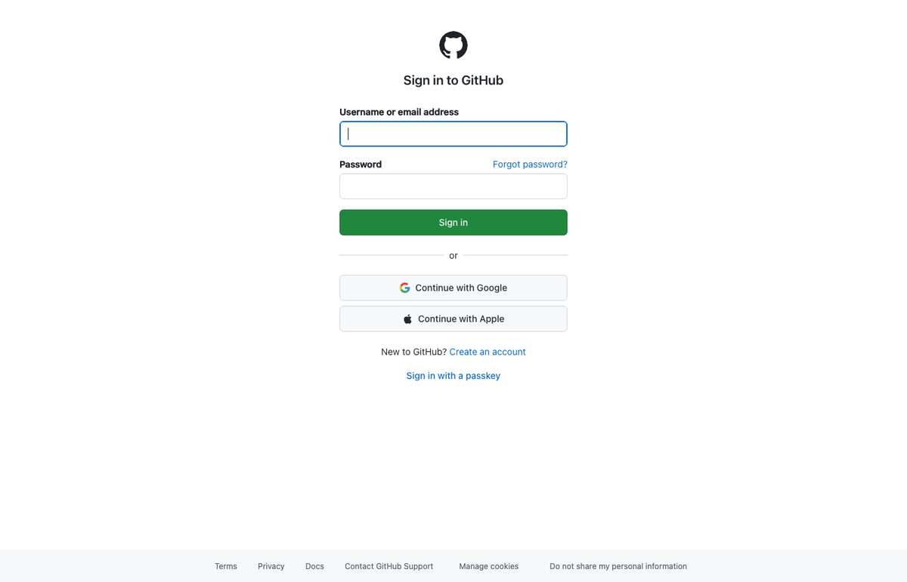

# 🚀 Full-Stack Development Portfolio

> **Real production systems built by a brand consultant who delivers results.**

**20+ Production-Ready Capabilities** | **Zero Bullshit** | **Results Over Process**

This repository showcases what I can deliver for clients - from viral content APIs to zero-cost email platforms to AI routing systems. Every project is documented, tested, and ready to deploy.

👉 **See [CAPABILITIES.md](CAPABILITIES.md) for the full portfolio**

[](https://github.com/calos/agent-router)
[](LICENSE)
[](https://nodejs.org)

---

## 💼 What I Build

- **Viral Content APIs** - Meme generation with GIF/MP4 export, OpenAPI specs, Python SDKs
- **Zero-Cost Infrastructure** - Email marketing for $0/month (vs $300/month SendGrid)
- **AI Routing Systems** - Multi-model AI with ELO ranking and cost optimization
- **EdTech Platforms** - Learning paths with gamification and real-time collaboration
- **Payment Systems** - Stripe integration with automated billing and content gating
- **OAuth & Auth** - Complete SSO with provider/consumer capabilities
- **Real-Time Features** - WebSocket streaming, live chat, session tracking
- **Analytics Pipelines** - Time-series data, OHLCV candles, ecosystem graphs

**Not a demo. Not a tutorial. Production code that ships.**

---

# CalOS Agent Router

> AI-powered routing system with blockchain-inspired session management, autonomous building, and real-time collaboration

## 🎯 Features

### 🔗 Session Block System **(NEW in v1.2.0)**
- **Blockchain-Inspired Architecture**: Sessions as blocks with priority ("gas") queuing
- **Internal-First Routing**: Ollama models get priority, external APIs (Claude/GPT) rate-limited
- **Room-Based Persistence**: Sessions lock to rooms until completion
- **Real-Time Monitoring**: Blocknative-style live tracking of queue state
- **Priority Boosting**: Auto-boost aging blocks, manual gas increases
- **Deadline Management**: Timeout handling with countdown alerts
- **Color-Coded UI**: Visual room organization with custom color schemes

### Core Agent Router
- **Multi-Provider AI Support**: OpenAI (GPT-4, GPT-3.5), Anthropic Claude, DeepSeek, Ollama
- **Specialized Agents**: Browser, Hacker News, GitHub, Price tracking
- **Smart Routing**: Automatic model selection based on task requirements
- **Context Management**: Efficient token usage with intelligent chunking

### 🎧 Lofi Streaming System **(NEW in v1.1.0)**
- **Real-Time Room**: Live viewer count, session tracking, peak metrics
- **AI Chat Assistant**: Integrated GPT/Claude with slash commands
- **Song Requests**: Badge-gated queue system with moderation
- **Heatmap Tracking**: Visual click/hover analytics with canvas overlay
- **WebSocket Broadcasting**: Room-scoped real-time updates

### 🏆 ELO Rating System
- **Voting Interface**: Chess.com-style matchups for recipes
- **Spam Prevention**: Device fingerprinting, rate limiting, duplicate detection
- **Badge System**: 7-tier reputation (Newcomer → Legend)
- **Trust Scoring**: Behavioral analysis for bot detection

### 🔐 Authentication
- **SSO Support**: Unified authentication system
- **OAuth Consumer**: Sign in WITH Google/GitHub/Microsoft/Yahoo/AOL
- **OAuth Provider**: Sign in WITH CalOS for third-party apps
- **Session Management**: JWT tokens with refresh support

### 💳 Payment & Subscriptions **(NEW)**
- **Stripe Integration**: Subscription billing for Pro/Enterprise tiers
- **Email Confirmations**: Automated emails for payments, subscriptions, and failures
- **Content Access Control**: Tier-based documentation and feature gating
- **Multi-Provider Email**: SendGrid, Mailgun, Postmark, or SMTP support
- **Webhook Processing**: Automatic payment event handling and database updates

### 📚 Automated Documentation System **(NEW)**
- **Screenshot Annotation**: Add arrows, boxes, and text overlays to guide users
- **Video/GIF Export**: Convert documentation screenshots to animated tutorials
- **PowerPoint Generation**: Create presentation slides from annotated screenshots
- **QR Code Integration**: Generate scannable codes linking to mobile tutorials
- **Background Processing**: Async job queue for export generation
- **Real-Time Progress**: WebSocket updates during export processing
- **Visual Differentials**: Highlight changes between steps with colored overlays


*Example: Automated step-by-step tutorial with visual annotations highlighting each action*

**Features**:
- 🎨 Pulsing boxes for important UI elements
- 🟢 Green highlights for navigation steps
- 🔵 Blue boxes for form fields
- 🟡 Yellow emphasis for credentials
- 📝 Text labels on each annotation

### 📊 Data & Analytics
- **Price Worker**: Auto-fetching crypto & stock prices
- **Candle Generation**: 5m, 1h, daily OHLCV data
- **Session Analytics**: Bounce rate, duration, interaction tracking
- **Scheduler**: Automated data processing and cleanup

## 🚀 Quick Start

### Prerequisites
- Node.js >= 18.0.0
- PostgreSQL >= 14 (or SQLite for development)
- OpenAI API key (optional)

### Installation

```bash
# Clone the repository
git clone https://github.com/calos/agent-router.git
cd agent-router

# Install dependencies
npm install

# Set up environment
cp .env.example .env
# Edit .env with your API keys

# Run database migrations
npm run migrate

# Start the server
npm start
```

### Development Mode

```bash
# Start with nodemon (auto-restart on changes)
npm run dev

# Start with local database
node router.js --local
```

## 📖 Usage

### Access the Web Interfaces

- **Lofi Streaming**: http://localhost:5001/lofi-stream.html
- **ELO Voting**: http://localhost:5001/swiper-cooking-elo.html
- **Chat Interface**: http://localhost:5001/chat.html
- **Unified Feed**: http://localhost:5001/feed.html
- **Status Dashboard**: http://localhost:5001/status.html

### API Examples

#### Submit a Session Block (Blockchain-Style Request)
```javascript
const response = await fetch('http://localhost:5001/api/blocks/submit', {
  method: 'POST',
  headers: { 'Content-Type': 'application/json' },
  body: JSON.stringify({
    model: 'ollama:mistral',  // Internal model (fast, priority)
    prompt: 'Explain quantum computing',
    roomSlug: 'python',        // Optional: room context
    priority: 75,              // "Gas" priority (0-100)
    urgent: false,             // Mark as urgent
    deadlineMs: 60000          // 1 minute deadline
  })
});
// Returns: { blockId, status, queuePosition, deadlineAt }
```

#### Check Block Status
```javascript
const status = await fetch('http://localhost:5001/api/blocks/{blockId}');
// Returns: { status, priority, queueTime, result }
```

#### Boost Block Priority (Increase Gas)
```javascript
await fetch('http://localhost:5001/api/blocks/{blockId}/boost', {
  method: 'POST',
  body: JSON.stringify({ boostAmount: 20 })
});
```

#### Call an AI Agent (Legacy Method)
```javascript
const response = await fetch('http://localhost:5001/agent', {
  method: 'POST',
  headers: { 'Content-Type': 'application/json' },
  body: JSON.stringify({
    agent: '@gpt4',
    input: 'Explain quantum computing in simple terms',
    context: {}
  })
});
```

#### Request a Song in Lofi Room
```javascript
const response = await fetch('http://localhost:5001/api/lofi/request-song', {
  method: 'POST',
  headers: { 'Content-Type': 'application/json' },
  body: JSON.stringify({
    deviceId: 'your-device-id',
    songTitle: 'Chill Vibes',
    songArtist: 'Lofi Girl',
    songUrl: 'https://youtube.com/...',
    message: 'Great study music!'
  })
});
```

#### Submit ELO Vote
```javascript
const response = await fetch('http://localhost:5001/api/elo/match', {
  method: 'POST',
  headers: { 'Content-Type': 'application/json' },
  body: JSON.stringify({
    winnerId: 123,
    loserId: 456,
    matchupType: 'recipe',
    voteContext: { duration_ms: 5000 }
  })
});
```

### Chat Assistant Commands (Lofi Room)

- `/help` - Show available commands
- `/recommend` - Get song recommendations
- `/lookup [artist]` - Look up artist information
- `/stats` - View room statistics

## 🏗️ Architecture

```
┌─────────────────┐
│  Web Clients    │ (HTML/JS/WebSocket)
└────────┬────────┘
         │
┌────────▼──────────────────────────────────┐
│          Express.js Router                 │
│  ┌──────────────────────────────────────┐ │
│  │  Routes Layer                        │ │
│  │  /api/lofi, /api/elo, /api/auth     │ │
│  └──────────────┬───────────────────────┘ │
│                 │                          │
│  ┌──────────────▼───────────────────────┐ │
│  │  Business Logic Layer                │ │
│  │  • SessionTracker                    │ │
│  │  • BadgeSystem                       │ │
│  │  • ELO Calculator                    │ │
│  │  • AgentRunner (AI)                  │ │
│  └──────────────┬───────────────────────┘ │
└─────────────────┼─────────────────────────┘
                  │
┌─────────────────▼─────────────────────────┐
│         Data Layer (PostgreSQL)           │
│  • visit_sessions, heatmap_data           │
│  • song_requests, room_state              │
│  • user_devices, elo_matches              │
│  • elo_user_votes, oauth_providers        │
└───────────────────────────────────────────┘
```

See [ARCHITECTURE.md](ARCHITECTURE.md) for detailed system design.

## 📚 Documentation

- [**API Reference**](API.md) - Complete API documentation
- [**Architecture**](ARCHITECTURE.md) - System design and data flow
- [**Changelog**](CHANGELOG.md) - Version history and release notes
- [**Deployment**](docs/DEPLOYMENT.md) - Production deployment guide

## 🛠️ Development

### Project Structure

```
agent-router/
├── agents/              # AI agent implementations
├── routes/              # Express route handlers
├── lib/                 # Core libraries
│   ├── session-tracker.js
│   ├── badge-system.js
│   ├── rate-limiter.js
│   └── ...
├── public/              # Frontend HTML/JS
│   ├── lofi-stream.html
│   ├── swiper-cooking-elo.html
│   └── lib/
│       └── heatmap-tracker.js
├── database/
│   └── migrations/      # SQL migration files
├── router.js            # Main application entry
└── package.json
```

### Running Tests

```bash
# Run all tests
npm test

# Run specific test suite
npm run test:unit
npm run test:integration
```

### Code Style

This project uses:
- **ESLint** for code linting
- **Prettier** for code formatting
- **Conventional Commits** for commit messages

```bash
# Format code
npm run format

# Lint code
npm run lint
```

## 🐳 Docker Deployment

```bash
# Build Docker image
docker build -t calos-agent-router .

# Run with Docker Compose
docker-compose up -d

# View logs
docker-compose logs -f
```

## 🔐 Environment Variables

Create a `.env` file with the following:

```env
# Server
PORT=5001
NODE_ENV=production

# Database
DB_HOST=localhost
DB_PORT=5432
DB_NAME=calos
DB_USER=postgres
DB_PASSWORD=your-password

# AI Providers
OPENAI_API_KEY=sk-...
ANTHROPIC_API_KEY=sk-ant-...
DEEPSEEK_API_KEY=...

# OAuth (optional)
GOOGLE_CLIENT_ID=...
GOOGLE_CLIENT_SECRET=...
GITHUB_CLIENT_ID=...
GITHUB_CLIENT_SECRET=...

# Stripe Payment Processing
STRIPE_SECRET_KEY=sk_test_...
STRIPE_WEBHOOK_SECRET=whsec_...

# Email Configuration (choose one provider)
EMAIL_PROVIDER=sendgrid  # Options: sendgrid, mailgun, postmark, smtp
EMAIL_FROM=noreply@calos.app
EMAIL_FROM_NAME="CalOS Platform"

# SendGrid (if using EMAIL_PROVIDER=sendgrid)
SENDGRID_API_KEY=SG...

# Mailgun (if using EMAIL_PROVIDER=mailgun)
MAILGUN_API_KEY=...
MAILGUN_DOMAIN=mg.calos.app

# Postmark (if using EMAIL_PROVIDER=postmark)
POSTMARK_SERVER_TOKEN=...

# SMTP (if using EMAIL_PROVIDER=smtp - works with any provider)
SMTP_HOST=smtp.gmail.com
SMTP_PORT=587
SMTP_USER=your-email@gmail.com
SMTP_PASS=your-app-password
```

## 💳 Payment Setup Guide

### 1. Configure Stripe

**Create Stripe Account:**
1. Sign up at [stripe.com](https://stripe.com)
2. Navigate to Developers → API keys
3. Copy your Secret Key to `.env` as `STRIPE_SECRET_KEY`

**Set Up Webhook:**
1. Go to Developers → Webhooks
2. Click "Add endpoint"
3. URL: `https://your-domain.com/api/webhook/stripe`
4. Select events:
   - `checkout.session.completed`
   - `invoice.paid`
   - `invoice.payment_failed`
   - `customer.subscription.deleted`
5. Copy the Webhook Secret to `.env` as `STRIPE_WEBHOOK_SECRET`

**Test Locally:**
```bash
# Install Stripe CLI
brew install stripe/stripe-cli/stripe

# Login to Stripe
stripe login

# Forward webhooks to localhost
stripe listen --forward-to localhost:5001/api/webhook/stripe

# Trigger test events
stripe trigger checkout.session.completed
stripe trigger invoice.paid
```

### 2. Configure Email Provider

Choose one of the following email providers:

**Option A: SendGrid (Recommended)**
1. Sign up at [sendgrid.com](https://sendgrid.com)
2. Create API key (Settings → API Keys)
3. Set in `.env`:
   ```env
   EMAIL_PROVIDER=sendgrid
   SENDGRID_API_KEY=SG...
   ```

**Option B: Mailgun**
1. Sign up at [mailgun.com](https://mailgun.com)
2. Get API key and domain
3. Set in `.env`:
   ```env
   EMAIL_PROVIDER=mailgun
   MAILGUN_API_KEY=...
   MAILGUN_DOMAIN=mg.yourdomain.com
   ```

**Option C: Postmark**
1. Sign up at [postmarkapp.com](https://postmarkapp.com)
2. Get server token
3. Set in `.env`:
   ```env
   EMAIL_PROVIDER=postmark
   POSTMARK_SERVER_TOKEN=...
   ```

**Option D: SMTP (Generic - works with Gmail, etc.)**
```env
EMAIL_PROVIDER=smtp
SMTP_HOST=smtp.gmail.com
SMTP_PORT=587
SMTP_USER=your-email@gmail.com
SMTP_PASS=your-app-password  # Generate app password in Google Account settings
```

### 3. Test the Payment Flow

**Test Email Sending:**
```bash
node -e "
const EmailSender = require('./lib/email-sender');
const sender = new EmailSender();
sender.sendSubscriptionConfirmation('your-email@gmail.com', {
  plan: 'Pro',
  price: 10,
  billingPeriod: 'month'
});
"
```

**Test Webhook Processing:**
```bash
# With Stripe CLI running in another terminal
stripe trigger checkout.session.completed

# Check server logs for:
# [Webhook:Stripe] Checkout completed for tenant...
# [Webhook:Stripe] Sent subscription confirmation to...
```

**Test Access Control:**
```bash
# Try accessing premium content as free user (should return 402)
curl http://localhost:5001/api/docs/snapshot/google-oauth-id

# Response: {"error": "Payment Required", "requiredTier": "pro"}
```

### 4. Access the Pricing Page

Navigate to: `http://localhost:5001/pricing.html`

**What Happens on Subscribe:**
1. User clicks "Subscribe to Pro"
2. Frontend creates Stripe checkout session via `/api/subscriptions/create`
3. User redirected to Stripe hosted checkout
4. After payment, Stripe sends webhook to `/api/webhook/stripe`
5. Server updates database tier and sends confirmation email
6. User can now access premium OAuth tutorials

**Tier Access Levels:**
- **Free**: GitHub OAuth tutorial only
- **Pro** ($10/month): All OAuth tutorials + video/GIF generation
- **Enterprise** ($50/month): Everything + unlimited API + priority support

For complete flow documentation, see [`docs/PAYMENT-FLOW.md`](docs/PAYMENT-FLOW.md)

## 📊 Monitoring

- **Health Check**: GET `/health`
- **Scheduler Stats**: GET `/api/scheduler/stats`
- **System Status**: http://localhost:5001/status.html
- **Logs**: `tail -f /tmp/calos-*.log`

## 🤝 Contributing

1. Fork the repository
2. Create a feature branch (`git checkout -b feature/amazing-feature`)
3. Commit your changes (`git commit -m 'feat: add amazing feature'`)
4. Push to the branch (`git push origin feature/amazing-feature`)
5. Open a Pull Request

Please follow [Conventional Commits](https://www.conventionalcommits.org/) for commit messages.

## 📋 Roadmap

### v1.2.0 (Planned)
- [ ] Real audio player integration (YouTube/Spotify API)
- [ ] Song skip voting system
- [ ] Advanced heatmap analytics dashboard
- [ ] AI-generated music visualizations
- [ ] Multi-room support (multiple lofi channels)

### v2.0.0 (Future)
- [ ] Plugin system for custom agents
- [ ] GraphQL API
- [ ] Mobile apps (React Native)
- [ ] P2P session sharing
- [ ] Blockchain-based reputation (optional)

## 📝 License

This project is licensed under the MIT License - see the [LICENSE](LICENSE) file for details.

## 👥 Authors

- **Cal** - *Initial work* - [GitHub](https://github.com/cal)

## 🙏 Acknowledgments

- Inspired by Habbo Hotel's verification system
- ELO algorithm based on Chess.com
- Lofi aesthetic inspired by Lofi Girl community
- Built with [Express.js](https://expressjs.com/), [PostgreSQL](https://www.postgresql.org/), and [WebSockets](https://github.com/websockets/ws)

---

**Built with ❤️ by the CalOS team**

[Website](https://calos.dev) • [Documentation](https://docs.calos.dev) • [Discord](https://discord.gg/calos)
